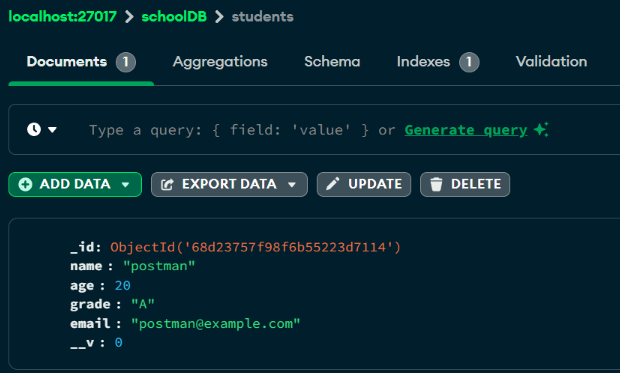

# Experiment 7: Mongoose Schema for a Resource (Student) and Insert Records

*Course Outcome (CO3):* Learn how to define a Mongoose schema and insert documents into a MongoDB collection.

---
## Screenshots

Here’s a preview of the app:




## Objective

- Setup a Node.js project with Mongoose.  
- Create a Student schema.  
- Insert records into MongoDB using Mongoose.  
- Test insertion using Postman.

---

## Prerequisites

- Node.js and npm installed.  
- MongoDB installed locally or Atlas account created.  
- Postman installed.

---

## Step 1: Create Project Folder

```bash
cd Desktop
mkdir mongoose-student-app
cd mongoose-student-app
